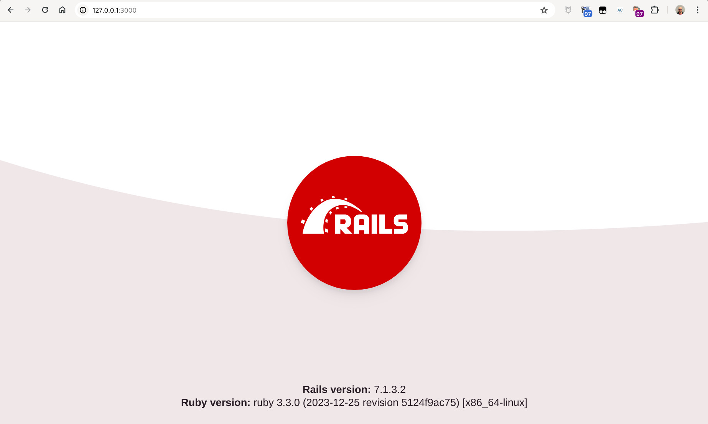
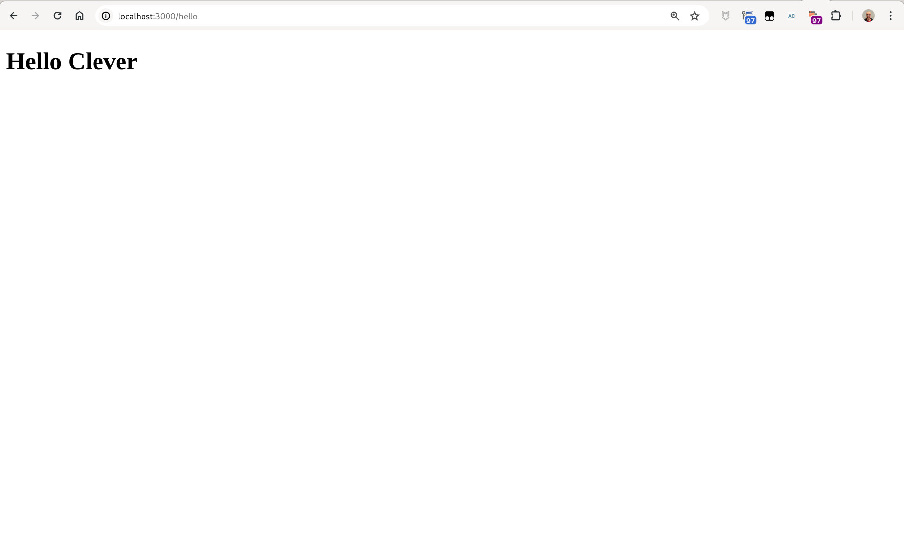
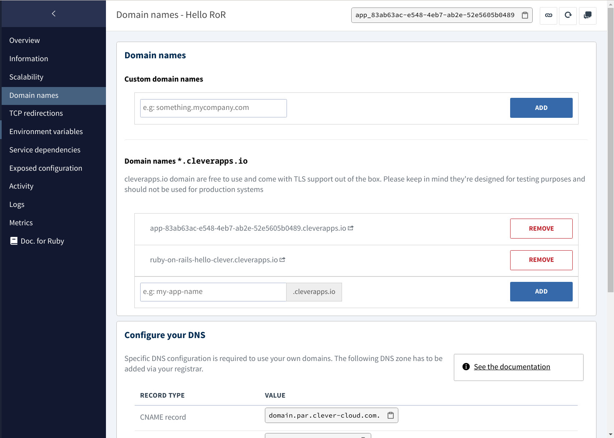
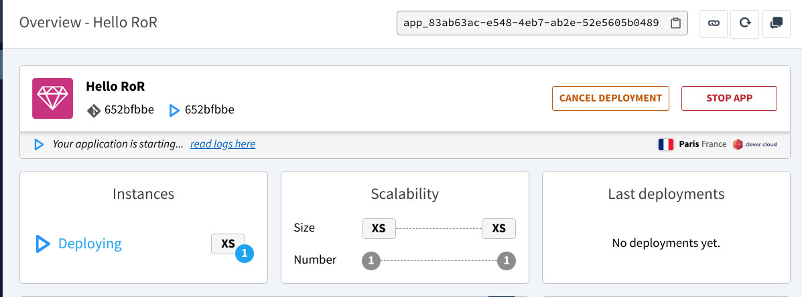
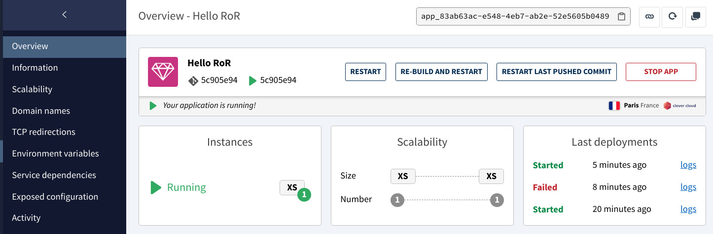
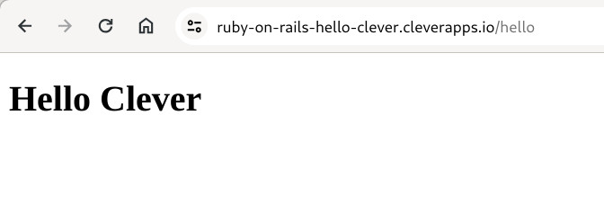

# Deploy a Ruby on Rails application of Clever Cloud

## Installing Rails

Before you install Rails, you should check to make sure that your system has the proper prerequisites installed. These include:

- Ruby 
- SQLite3 

### Verifying Ruby installation

Rails requires Ruby version 2.7.0 or later.

```bash
$ ruby -v
ruby 3.3.0 (2023-12-25 revision 5124f9ac75) [x86_64-linux]
```

### Verifying SQLite3 installation

Rails requires SQLite3.

```bash
$ sqlite3 --version
3.45.1 2024-01-30 16:01:20 e876e51a0ed5c5b3126f52e532044363a014bc594cfefa87ffb5b82257ccalt1 (64-bit)
```

### Installing Rails

To install Rails, use the gem install command provided by RubyGems:

```bash
$ gem install rails
Fetching thor-1.3.1.gem
Fetching rack-3.0.10.gem
Fetching rake-13.2.1.gem
Fetching zeitwerk-2.6.13.gem
Fetching webrick-1.8.1.gem
Fetching rackup-2.1.0.gem
Fetching reline-0.5.3.gem
[...]
Installing ri documentation for rails-7.1.3.2
Done installing documentation for zeitwerk, thor, rake, webrick, rack, rackup, reline, irb, concurrent-ruby, tzinfo, minitest, i18n, connection_pool, activesupport, racc, nokogiri, crass, loofah, rails-html-sanitizer, rails-dom-testing, rack-test, erubi, builder, actionview, actionpack, railties, marcel, activemodel, activerecord, globalid, activejob, activestorage, actiontext, net-smtp, net-pop, net-imap, mini_mime, mail, actionmailer, actionmailbox, websocket-extensions, websocket-driver, nio4r, actioncable, rails after 38 seconds
45 gems installed

$ rails -v
Rails 7.1.3.2
```

## Creating the Hello Clever Application

Rails comes with a number of scripts called generators that are designed to make your development life easier by creating everything that's necessary to start working on a particular task. One of these is the new application generator, which will provide you with the foundation of a fresh Rails application so that you don't have to write it yourself.

```bash
$ rails new hello_clever 
      create  
      create  README.md
      create  Rakefile
      create  .ruby-version
      create  config.ru
      create  .gitignore
      create  .gitattributes
      create  Gemfile
         run  git init from "."
Initialized empty Git repository in /home/horacio/git/clever-cloud/demos/ruby-on-rails/hello_clever/.git/
      create  app
[...]
  Appending: pin "@hotwired/stimulus", to: "stimulus.min.js"
      append    config/importmap.rb
  Appending: pin "@hotwired/stimulus-loading", to: "stimulus-loading.js"
      append    config/importmap.rb
  Pin all controllers
  Appending: pin_all_from "app/javascript/controllers", under: "controllers"
      append    config/importmap.rb
         run  bundle install
Bundle complete! 15 Gemfile dependencies, 83 gems now installed.
Use `bundle info [gemname]` to see where a bundled gem is installed.
```

### Starting Up the Web Server

```bash
$ cd hello_clever

$ rails server
=> Booting Puma
=> Rails 7.1.3.2 application starting in development 
=> Run `bin/rails server --help` for more startup options
Puma starting in single mode...
* Puma version: 6.4.2 (ruby 3.3.0-p0) ("The Eagle of Durango")
*  Min threads: 5
*  Max threads: 5
*  Environment: development
*          PID: 76194
* Listening on http://127.0.0.1:3000
* Listening on http://[::1]:3000
Use Ctrl-C to stop
```



### Say "Hello Clever"

To get Rails saying "Hello", you need to create at minimum a _route_, a _controller_ with an _action_, and a _view_. A _route_ maps a request to a _controller action_. A _controller action_ performs the necessary work to handle the request, and prepares any data for the _view_. A _view_ displays data in a desired format.

In terms of implementation: Routes are rules written in a Ruby DSL (Domain-Specific Language). Controllers are Ruby classes, and their public methods are actions. And views are templates, usually written in a mixture of HTML and Ruby.

Let's start by adding a route to our routes file, `config/routes.rb`, at the top of the `Rails.application.routes.draw` block:

```ruby
Rails.application.routes.draw do
  # Define your application routes per the DSL in https://guides.rubyonrails.org/routing.html

  # Say Hello Clever
  # GET /hello requests are mapped to the index action of HelloController.
  get "/hello", to: "hello#index"

end

```

To create `HelloController` and its `index` action, we'll run the controller generator (with the `--skip-routes` option because we already have an appropriate route):

```bash
$ rails generate controller Hello index --skip-routes
      create  app/controllers/hello_controller.rb
      invoke  erb
      create    app/views/hello
      create    app/views/hello/index.html.erb
      invoke  test_unit
      create    test/controllers/hello_controller_test.rb
      invoke  helper
      create    app/helpers/hello_helper.rb
      invoke    test_unit
```

Let's look at the controller in `app/controllers/hello_controller.rb`. Let's take a look at it:

```ruby
class HelloController < ApplicationController
  def index
  end
end
```

The `index` action is empty. When an action does not explicitly render a _view_ (or otherwise trigger an HTTP response), Rails will automatically render a _view_ that matches the name of the controller and action. Convention Over Configuration! Views are located in the `app/views` directory. So the `index` action will render `app/views/articles/index.html.erb` by default.

Let's open `app/views/articles/index.html.erb`, and replace its contents with:

```html
<h1>Hello Clever</h1>
```

Now visit `http://localhost:3000/hello`, and see our text displayed!




## Deploying Hello Clever app on Clever Cloud

### Configure your Ruby on Rails application 

Be sure that:

- you push to the master branch
- you commit your `gems.locked `or `Gemfile.lock` file
- you have a `config.ru` file (this one is most of the time generated by rails)
- you have `gem puma` in your Gemfile (`puma` is the default application server from rails, when creating a new ruby application, an environment variable is automatically added: `CC_RACKUP_SERVER=puma`)

You need to provide a `gems.locked` or `Gemfile.lock` file. To do that ensure you have at least once run `bundle install` in your terminal at the root of your rails project.

If you specify a ruby version in your `gems.rb `of `Gemfile`, we’ll use it. Otherwise, look at the [documentation page](https://developers.clever-cloud.com/doc/applications/ruby/).


### Add the domain name as `config.hosts` on your environment file

In the Clever Cloud console you can see and manage your application domain names:



Now you need to declare the domain name in your clever application, in `config/environments/production.rb`. You also need to set some values to deal with SSL and static files:

```ruby
  config.hosts = [
    "ruby-on-rails-hello-clever.cleverapps.io",
    "127.0.0.1"
  ]
  config.assume_ssl = true
  config.force_ssl = false
  config.serve_static_files = true
```

### Dealing with `secret_base_key`

There are many way to add secret key to your environment and each one is valid. Clever Cloud provides you a secure way so you don’t have to commit any file containing it.

1. Use  `rails credentials:edit` to see your `secret_key_base`
1. In the Clever Cloud console, declare a `SECRET_KEY_BASE` environment variable and give it the `secret_key_base` value
1. Add it to your environment in `./config/secret.yml` with:
   ```yml
   production:
     secret_key_base: <%= ENV["SECRET_KEY_BASE"] %>
   ```

### Dealing with static files

As we are using `puma` as server, we need to make sure that static assets are procompiled. In order to do it, make sure you have a `CC_RAKEGOALS` environment variable with value `assets:precompile`.

### Add the Clever Cloud git repository as remote 

```bash
$ git remote add clever git+ssh://git@push-n3-par-clevercloud-customers.services.clever-cloud.com/app_83ab63ac-e548-4eb7-ab2e-52e5605b0489.git

$ git add --all

$ git commit -m "Initial commit"
[main (root-commit) 652bfbb] Initial commit
 87 files changed, 1705 insertions(+)
 create mode 100644 .dockerignore
 create mode 100644 .gitattributes
 create mode 100644 .gitignore
[...]
 create mode 100644 vendor/.keep
 create mode 100644 vendor/javascript/.keep

$ git push -u clever main:master
Enumerating objects: 101, done.
Counting objects: 100% (101/101), done.
Delta compression using up to 20 threads
Compressing objects: 100% (83/83), done.
Writing objects: 100% (101/101), 93.76 KiB | 5.21 MiB/s, done.
Total 101 (delta 3), reused 0 (delta 0), pack-reused 0 (from 0)
remote: Resolving deltas: 100% (3/3), done.
remote: [SUCCESS] The application has successfully been queued for redeploy.
To git+ssh://push-n3-par-clevercloud-customers.services.clever-cloud.com/app_83ab63ac-e548-4eb7-ab2e-52e5605b0489.git
 * [new branch]      main -> master
branch 'main' set up to track 'clever/master'.
```

And the deployment begins:



After a few moments, the applcation will be deployed:



And we can go to the `/hello` route to verify it works:


